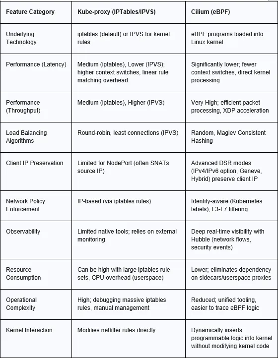

## What is kube-proxy?
kube-proxy is a network proxy that runs on each Worker Node. It manages the networking rules on the node, ensuring that network traffic is correctly
routed to and from the Pods.

## Why is kube-proxy Important?
Stable Communication: Even if Pods are added or removed, services remain accessible via the same IP and port.
Transparency: Applications don’t need to know the details of the underlying network — they communicate through services provided by kube-proxy.

### Example Scenario:

Service Creation: You create a Service called my-service that targets Pods with the label app=myapp.
Routing Setup: kube-proxy sets up rules so that any traffic to my-service is forwarded to one of the Pods matching the label.
Pod Changes: If a Pod is added or removed, kube-proxy updates the routing rules accordingly.

https://ambar-thecloudgarage.medium.com/ciliums-ebpf-powered-replacement-of-kube-proxy-in-kubernetes-networking-dc5cf0988f9d

### Routing Mode

We will choose overlay (Tunnelling)

With Overlay: A tenant cluster with 5 VMs uses only 5 host IPs, but can run 500 Pods internally using an isolated overlay CIDR.
With Direct Mode: Those 500 Pods would drain 500 IPs from your underlying infrastructure network, severely limiting how many
tenant clusters you can density-host.

### Bind address

In networking, 0.0.0.0 is a non-routable meta-IP address used as a wildcard. When you configure a server or service to bind to 0.0.0.0, you are instructing it to listen for incoming traffic on all available network interfaces simultaneously (e.g., local Wi-Fi, Ethernet, and localhost).
bind * also same.

## Cilium Configuration

#### GLM recommendation
https://opncd.ai/share/yJy00gkU
advertise-address: https://opncd.ai/share/eu0qwFdl

I now have a full picture of your environment. Here's the tailored recommendation (advisory only — I won't touch the clusters).
Environment summary (what drives the config)
- Infra/management cluster: Harvester (RKE2 + kube‑ovn/multus + whereabouts). Underlay gives KubeVirt VMs an MTU of 1442 on enp1s0.
- Tenant infra: KubeVirt VMs using pod‑network + bridge interfaces → each tenant node's only interface (enp1s0) carries the mgmt cluster pod IP as the tenant node IP (10.0.0.x). Tenant pod CIDR 10.243.0.0/16, services 10.95.0.0/16.
- Tenant control plane: Kamaji → API server runs in the mgmt cluster (10.2.0.66:6443), worker nodes reach it via Konnectivity agent.
- Bootstrap: kubeadm (so kube‑proxy DS exists).
- Already running: Cilium v1.19.5, kube-proxy-replacement=false, routing-mode=tunnel/vxlan, ipam=kubernetes, Hubble on, Envoy on, IPv4‑only. Cilium correctly auto‑picked enp1s0 and computed PodMTU = 1442 − 50 = 1392.
  Why tunnel (VXLAN) is right here
  KubeVirt bridges the VM straight onto the Harvester pod network (10.0.0.x). The mgmt underlay knows nothing about 10.243.0.0/16. Native routing would require Harvester/Canal routes + a separate physical L2 for tenant pods — not an option with pod‑network bridge and without modifying infra. VXLAN encapsulates tenant pod traffic inside tenant node‑to‑node UDP, tunneled again by Harvester's overlay (tunnel‑on‑tunnel). It costs ~MTU/perf, but it's the only correct, changes‑free option for this topology.
  Recommended values.yaml (per‑tenant, Cilium helm chart ∼1.19.x)
# -- Cilium values tuned for Kamaji(kubeadm) + KubeVirt pod-bridge tenants --
clusterName: capi-slowstart            # unique per tenant; used for Hubble/metrics identity

# ---- Identity / IPAM ----
identityAllocationMode: crd            # CRDs install into the Kamaji tenant API server
ipam:
mode: kubernetes                     # kubeadm/Kamaji assign node .spec.podCIDR (10.243.x.x)
operator:
identity:
allocationMode: crd

# ---- Dataplane (VXLAN tunnel — required for KubeVirt pod-bridge tenants) ----
routingMode: tunnel
tunnelProtocol: vxlan
autoDirectNodeRoutes: false
enableL2NeighDiscovery: false
ipv4:
enabled: true
ipv6:
enabled: false
ipv4Masquerade: true                   # SNAT pod->external (API LB 10.2.0.66, konnectivity-server)
enableIPv6Masquerade: false

# ---- Device selection (pin to the VM's bridge iface) ----
# Cilium auto-detects enp1s0 today; pin it because multus/openstack annotations on the
# KubeVirtMachineTemplate may add iface enp2s0 later and cause mis-detection.
devices: "enp1s0"

# ---- MTU (Harvester gives enp1s0 = 1442; VXLAN -50 => PodMTU 1392) ----
mtu: 1392                              # explicit instead of auto for reproducible deploys

# ---- kube-proxy handling ----
# Option A (current, zero bootstrap change): keep kubeadm kube-proxy, Cilium in hybrid mode.
kubeProxyReplacement: false            # recommended if you do NOT want to touch KubeadmConfigTemplate

# Option B (best, requires ONE bootstrap template change — see notes):
# kubeProxyReplacement: true
# kubeProxyReplacementHealthzBindAddr: "0.0.0.0:10256"
# k8s:
#   kubeProxyReplacement: strict

# ---- CNI behavior ----
cni:
exclusive: true                      # Cilium owns /etc/cni/net.d
install: true
chaining:
mode: none                         # standalone (do not chain on Canal/Calico)

# ---- Policy ----
enableNetworkPolicy: true
policyEnforcementMode: default        # default-deny-friendly
enableNonDefaultDenyPolicies: true

# ---- L7 / Envoy (enable only if you use L7 netpol, Cilium Ingress or Gateway API) ----
# Right now it's on; if unused, turn it off to drop the cilium-envoy DS and CPU/mem per node.
# l7Proxy: false
# envoy:
#   enabled: false
# If you keep it:
l7Proxy: true
envoy:
enabled: true
securityContext:
capabilities:
add: [NET_BIND_SERVICE]

# ---- Observability ----
hubble:
enabled: true
relay:
enabled: true
ui:
enabled: true
metrics:
enabled:
- dns
- http
- port-distribution
- tcp
- flow-to-world
tls:
auto:
enabled: true

# ---- BPF sizing for 4-core/16Gi VMs ----
bpf:
mapDynamicSizeRatio: 0.0025
lbMapMax: 65536
policyMapMax: 16384
enableBPFClockProbe: false             # VM clock source may be unstable; avoid probe
enableIPv4BigTCP: false               # needs kernel + headroom; skip inside VMs
bpfLBAcceleration: disabled            # risky in VM kernel; keep off
enableSCTP: false

# ---- Node readiness (critical for VMs that boot slowly) ----
nodeInit:
enabled: true                        # ensures BPF fs / cgroup mounts before agent
enableAutoProtectNodePortRange: true
agentReadyTaintKey: "node.cilium.io/agent-not-ready"

# ---- Multi-tenant note ----
# If you ever enable ClusterMesh across tenants, give EACH tenant a unique clusterID:
# clustermesh:
#   config:
#     enabled: true
#   clusterID: <1..254>  # MUST be unique per tenant
clustermesh:
config:
enabled: false
cluster:
name: capi-slowstart
id: 0

# ---- Operator / metrics ----
operator:
replicas: 1                          # 1 is fine per tenant; set 2 only for HA in big tenants
prometheus:
enabled: true
prometheus:
enabled: true
serviceMonitor:
enabled: false                     # flip on if mgmt Prometheus has tenant ServiceMonitors

# ---- Gateway / Ingress (optional) ----
# ingressController:
#   enabled: true                      # only if you use Cilium Ingress; uses Envoy
# gatewayAPI:
#   enabled: false
Key reasons per setting (mapped to your stack)
Setting	Why for Kamaji+KubeVirt+kubeadm
routingMode: tunnel + vxlan	VMs sit on a pod‑network (10.0.0.x); mgmt underlay doesn't know 10.243.0.0/16. Native routing needs infra changes / multus L2 network. VXLAN needs none.
ipam.mode: kubernetes	Kamaji/kubeadm put podCIDR on each Node; Cilium uses it. Avoids cluster‑pool collisions with mgmt pod CIDR.
identityAllocationMode: crd	Tenants are isolated control planes; CRD identities are cleaner than kvstore. Cilium installs CRDs into the Kamaji tenant API server.
devices: enp1s0	Your VM's bridge interface is enp1s0. Avoids misdetection if openstack/multus interfaces get added (your KubeVirtMachineTemplate already carries those annotations).
mtu: 1392	enp1s0 = 1442 (Harvester underlay), VXLAN −50 = 1392. Explicit value makes every tenant deploy identical.
ipv4Masquerade: true	Pods reaching the Kamaji API LB (10.2.0.66) and the konnectivity server must SNAT to the node IP. Default exclusions keep pod→pod/service non‑SNATed.
ipv6.enabled: false	KubeVirt pod‑network gives IPv4 only.
kubeProxyReplacement: false (hybrid)	Matches kubeadm's existing kube‑proxy DS — no bootstrap changes. Safe and fully functional.
enableIPv4BigTCP, bpfLBAcceleration off	VM kernels may not expose stable support; tunnel‑on‑tunnel leaves little headroom.
nodeInit.enabled + agent‑not‑ready taint	KubeVirt VMs boot slowly with cold caches; this prevents tenant pods scheduling before Cilium is ready.
Optional: full kube‑proxy replacement (the truly "best" dataplane)
Cilium replacing kube‑proxy is optimal, but it is a bootstrap‑time change (not an in‑place path). For new tenants, edit the KubeadmConfigTemplate (or ClusterClass bootstrap) to skip the kube‑proxy addon:
spec:
template:
spec:
# join this phase-skip into the existing template
files: [...existing...]
users:   [...existing...]
preKubeadmCommands: [...existing...]
# existing template above stays; ADD the joinConfiguration override:
joinConfiguration:
nodeRegistration:
kubeletExtraArgs:
# keep nothing special; cilium handles svc LB
controlPlane: {}     # not used for worker nodes
# KEY BIT: tell kubeadm to not install kube-proxy
# (applies via the cluster init config; for workers it's inherited)
initConfiguration:
skipPhases: ["addon/kube-proxy"]
clusterConfiguration:
skipPhases: ["addon/kube-proxy"]
Then set Helm kubeProxyReplacement: true (Option B above) and do not deploy the kube‑proxy DS. Existing capi-slowstart already runs kube‑proxy, so for it stay on hybrid (false) — you cannot cleanly remove kube‑proxy on an existing cluster without disruptiveness.
Other recommendations
1. Install via Helmet/ClusterResourceSet, not mgmt‑cluster helm — apply the Cilium helm release into the tenant cluster (using the tenant admin kubeconfig from Kamaji), tied to a ClusterResourceSet so every new tenant gets it automatically. (Looks like you already do this — Cilium is present in the tenant kube-system.)
2. Unique clusterName/cluster.id per tenant — essential for Hubble metrics correlation and mandatory before ever wiring ClusterMesh across tenants;tidens up multi‑tenant dashboards.
3. Envoy/L7 proxy — only keep enabled if you use L7 NetworkPolicy, Cilium Ingress, or Gateway API. On 4c/16Gi VMs each tenant pays one envoy DS pod + ~150‑300MB. Disabling (l7Proxy: false, envoy.enabled: false) is the bigger resource win in dense tenants.
4. Don't enable BGP/native/cluster‑mesh against the pod‑network‑bridge topology — it can't learn underlay routes and will flap.
5. Pod ready health for VMs — nodeInit.enabled: true + the agent-not-ready taint is important because KubeVirt VMs take time to boot and konnectivity-agent/coredns can otherwise schedule before the CNI is functional.